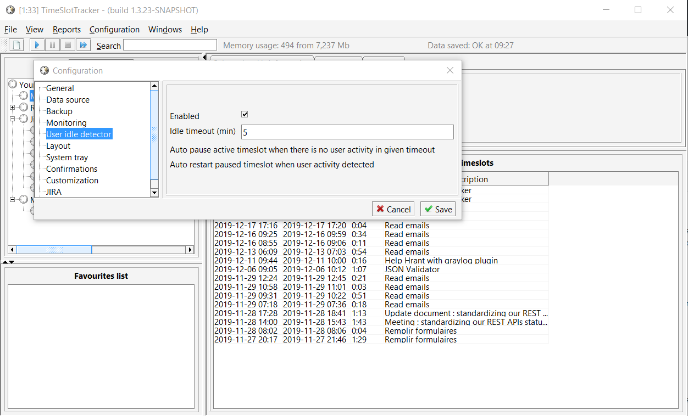
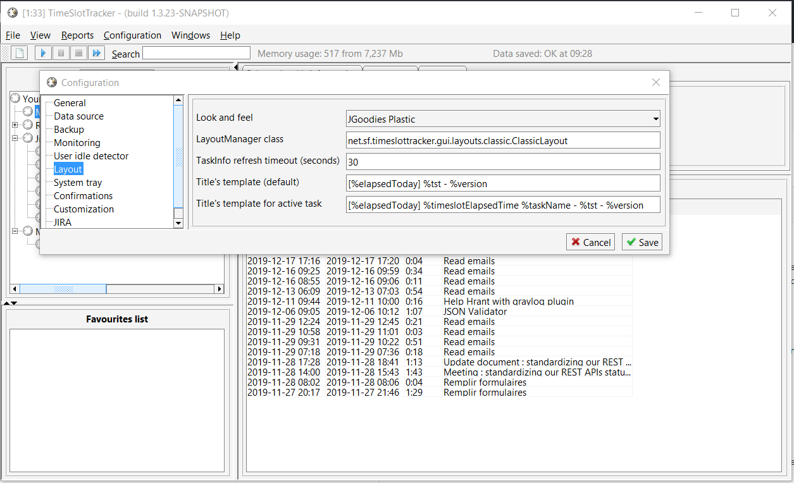
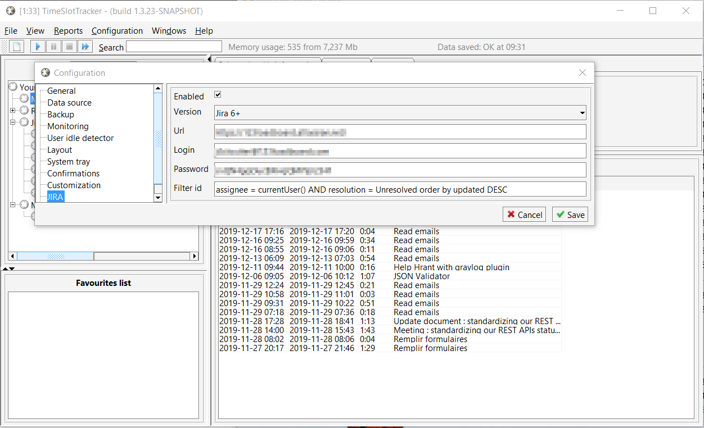
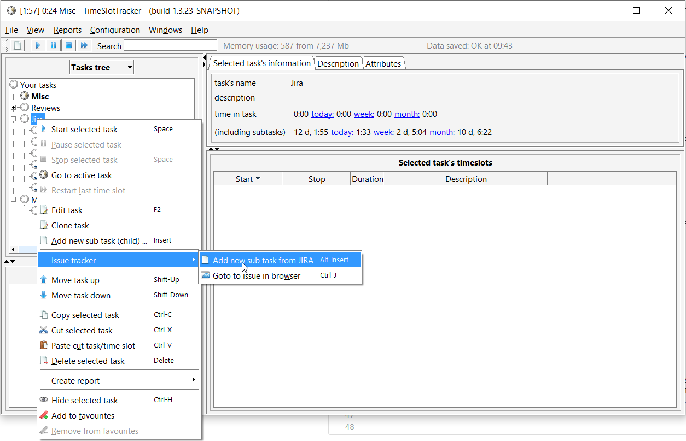
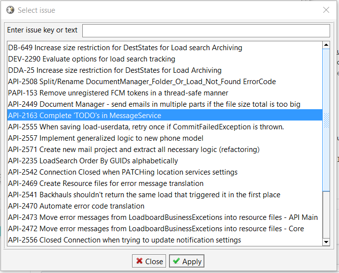
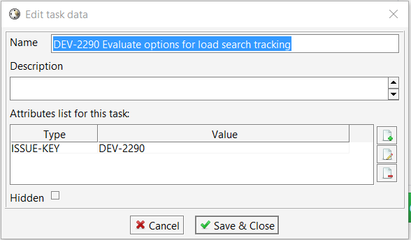

# TimeSlotTracker++

Welcome to TimeSlotTracker++. On this page, you will find a fork of the original TimeSlotTracker tool found [here](https://sourceforge.net/projects/timeslottracker/). The main difference of this forked project is that the Jira integration works with the latest Jira versions.

# Installation

For the time being, you can download the JAR [here](TimeSlotTracker.jar).

You will need Java JRE 8 or later. You launch TimeSlotTracker like so:

    $(JAVA_HOME)\bin\javaw -jar /path/to/TimeSlotTracker.jar

# Initial configuration

Pretty much all the default configuration should be good enough. However, we recommend the following configuration tweaks though.

So in the menu, click on "Configuration" then "Configuration" again.

## User idle detector

This will automatically pause the timer for you if you walk away from your desk and forget to stop it. We recommend setting it to 5, but it's really up to you.

## Layout

You can customize what is displayed in the window title. Here are the settings that we recommend:

Field | Value
----- | -----
Title's template (default) | [%elapsedToday] %tst - %version
Title's template for active task | [%elapsedToday] %timeslotElapsedTime %taskName - %tst - %version

Variables that you can use:

* timeslotElapsedTime
* timeslotDescription
* tst
* version
* taskName
* taskElapsedTime
* elapsedToday
* plannedToday
* remainToday
* workingPercentDone

## Jira

Field | Value
----- | -----
| Url | https://jira.mycompany.com/ |
| Login | username@mycompany.com |
| Password | Authorization token, not your actual password. See https://confluence.atlassian.com/cloud/api-tokens-938839638.html |
| Filter Id | The default value is "-1" which is the "Assign to me" filter. However, some versions of Jira does not allow specifying a filter Id. As such, you can enter the JQL instead, e.g. `assignee = currentUser() AND resolution = Unresolved order by updated DESC` |

# Using TimeSlotTracker

You can create any task tree that you want. You can create tasks that are not necessarily bound to a Jira ticket.

However, if you interested in having TimeSlotTracker keep your Jira work log up to date, there are two approaches.

Select a task where you want to add Jira ticket (in my case, I had a task called "Jira"), right click on it, click on "Issue tracker", and then click on "Add new sub task from JIRA" (or press Alt + insert).

If you have configured your Jira filter properly, you should have a list of the matching Jira ticket:

Select one, then click "Apply". It will be added as a sub-task, and you can start monitoring the time you spent in this task using the play and stop buttons.

If for some reason, the ticket you want to add is not found by your filter, it is possible to add the ticket manually.

Select the task under which you will want to add the Jira ticket (in my case, I select "Jira" by left-clicking on it) then press "Insert" (you can also find it by right-clicking on "Jira"). Enter a name for your Jira ticket. Also, add an attribute called "ISSUE-KEY" and specify the Jira ticket key:

